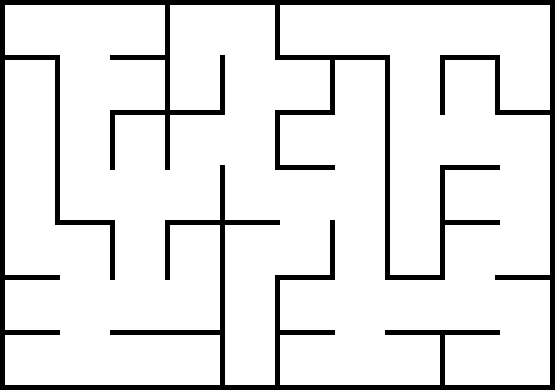
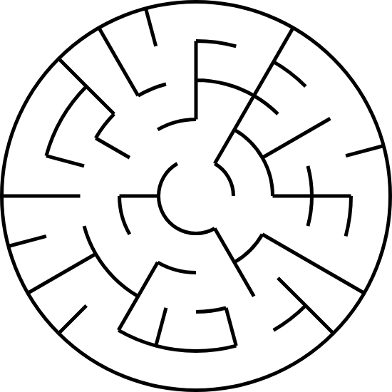
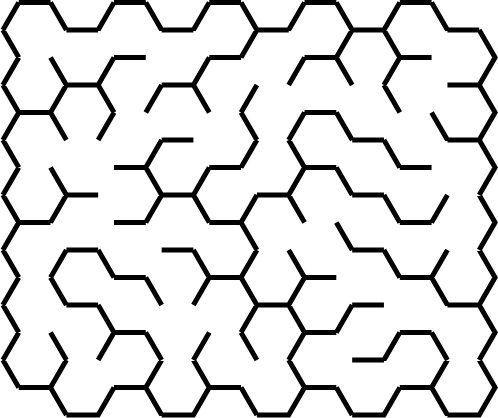
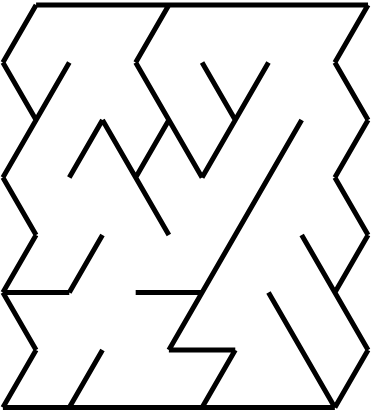

# Try Mazes

This is an exercise while reading *Mazes for Programmers Code Your Own Twisty Little Passages*. The crate implements all algorithms introduced in the book, but only for mazes in 2D. In addition the library, there are four demo binaries to show functions in the library, each one targets the particular grid. 

## Grids

The supported grids have four kinds, they are different in the shape of the cell and  the neighbor relations.

### Rectangular Grid

The cell is a square, and expands in four directions: the north, the east, the west and the south.

### Circular Grid

Every cell is an annular sector. It can step to the inward annulus, the outward annulus, or the neighbor sectors in the same annulus.

### Hexagonal Grid

Each cell is a regular hexagon, and it can move to the north, the north east, the southeast, the south, the southwest and the northwest.

### Triangular Grid

Each cell is a regular triangle, either point up or point down. the pointed up cell can connect to the northwest, the northeast and the south, the pointed down cell can connect to the north, the southeast, the southwest.

## Algorithms

Not all algorithms are suitable for every kind of grid, the supporting is listed in the table below:

| Algorithm/Grid        | Rectangular  | Circular | Hexagonal    | Triangular |
| --------------------- | ------------ | -------- | ------------ | ---------- |
| Aldous-Broder         | All          | All      | All          | All        |
| Binary Tree           | No Mask Only | Not      | Not          | Not        |
| Eller's               | No Mask Only | All      | No Mask Only | Not        |
| Growing Tree          | All          | All      | All          | All        |
| Hunt-and-Kill         | All          | All      | All          | All        |
| Kruskal's             | All          | All      | All          | All        |
| Prim's                | All          | All      | All          | All        |
| Recursive Backtracker | All          | All      | All          | All        |
| Recursive Division    | No Mask Only | Not      | Not          | Not        |
| Sidewinder            | No Mask Only | Not      | Not          | Not        |
| Wilson's              | All          | All      | All          | All        |

## Masking

The masking is the way to fine tune the maze shape. The masked maze can be no longer in a rectangle-like contour. All grids except the circular grid can be masked, and It can be introduced in two ways: text or image.

### Text Mask

The mask is a character matrix which is equal-sized with the maze. Except the **'x'** or **'X'** , every character in the matrix represents the cell at the same position in the maze. For example, the mask below will mask out the center cell in the maze(3 x 3).

ooo

oxo

ooo

### Image Mask

Every pixel in the image except the **black** counts a cell in the maze. The image below can make the maze shaped into the "MAZES" text form.

## Display

All the mazes can be displayed in a simple window(GUI), that is, in a picture. Aside from that, a maze based on the rectangular grid can also be displayed in text, either in ASCII or Unicode, with the box-drawing characters.

## Save & Load

All mazes can be saved in a picture file(jpeg or png format), or in a text(json format) file. The text file can be loaded later to get the same maze back into the memory.
